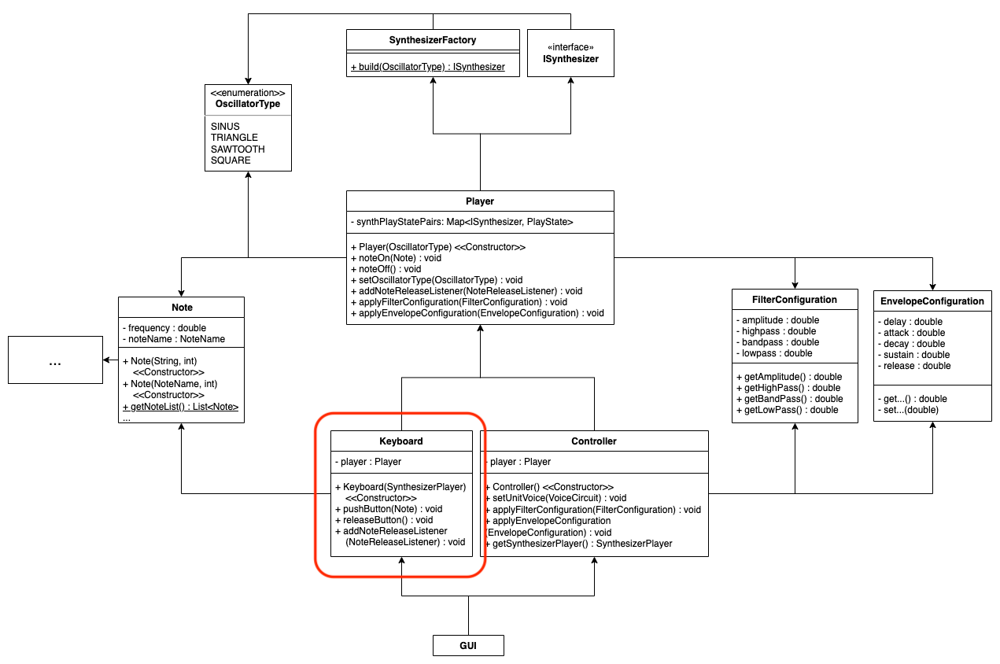
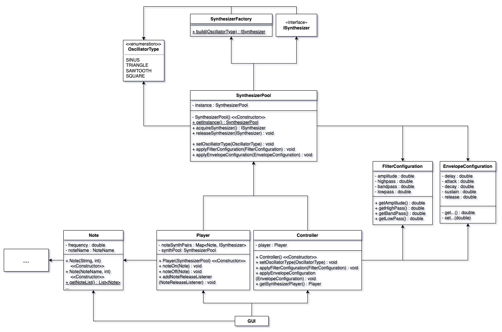
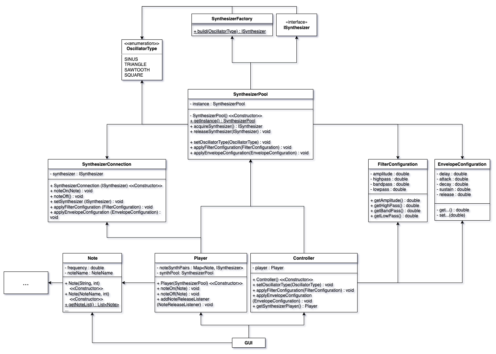

# JavaAudioSynthesizer
This repository contains a programming project, which has to be developed during a lecture at DHBW Karlsruhe. This documentation contains the results of analyzes and reasons for decisions made. 

## Entwurfsmuster

##### Einsatz begründen
UML Vorher / nacher

## Clean Architecture

##### Schichtarchitektur

## Domain Driven Design

##### Analyse der Ubiquitous Language

##### Analyse und Begründung der verwendeten Muster

## Programming Principles 

##### SOLID

##### GRASP

##### DRY

# Refactoring 1 - Technische Domäne von Fachlicher Domäne trennen
Für die Synthetisierung von Klang wird aktuell eine Library namens "JSyn" verwendet. Der Synthesizer von jsyn benötigt zum Synthetisieren eines Tons einen Oszillator. Es gibt verschiedene Arten von verfügbaren Oszillatoren. Für die Konfiguration der Klangfarbe werden zusätzlich Filter und ein "Envelope" Tool, was das Ein- und Ausklingen des Tons bestimmt, benötigt. Anfangs wurde diese Library in verschiedenen Stellen der Applikation verwendet, wobei einzelne Klassen, wie z.B. Synthesizer Objekte von den Oszillator Objekten an verschiedenen Orten gespeichert und verwendet wurden. Zum Beispiel: 

- In SynthesizerPlayer: *UnitVoice*, *Synthesizer*
- In OscillatorVoiceUnit: *UnitOscillator*, *Circuit*, + mehrere Module zur Klangmodifikation
- In VoiceCircuit: *UnitVoice*

In der folgenden Abbildung wurden die verschiedenen Speicher- oder Verwendungsorte farblich markiert. 

Die Library zur Klangerzeugung lässt sich also nicht leicht austauschen. Um das zu ändern, soll nur noch ein Objekt, der vollständigen Erzeugung eines Tons dienen. Mehrere Objekte der JSyn Library sollen also in einer Klasse gekapselt werden, welche dann über ein Interface zugänglich ist. Im Folgenden ein vereinfachtes UML Diagramm nach angewendetem Refactoring.

Zur besseren Sicherbarkeit der relevanten Klassen: 

Die blau markierten Deklarationen, sind abstrakte Methoden, welche eine Implementieren benötigen. Die grün markierten Deklarationen sind die tatsächliche Implementierungen der abstrakten Methoden. 

Dabei wurde das Factory Pattern verwendet, welches anhand des Enums *OscillatorType* die passende Implementierung baut und zurückgibt. 

Die Klasse *JSynSynthesizer* enthält bis auf den Oszillator alle nötigen Objekte um mit der JSyn Library Klang zu erzeugen. Der Oszillator wird dann durch Vererbung von der Kind Klasse beigesteuert. Eine Kind Klasse implementiert also die Verwendung eines Oszillator-Typs. 

# Refactoring 2 - Einführung einer Synthesizer Pool Klasse
Damit die Controller Klasse nur für bestimmte Aufgaben zuständig ist und nicht für alle die zur Steuerung der Synthesizer notwendig sind, wurde anfangs die *Keyboard* Klasse entwickelt (auf unterem Bild markiert). Diese sollte sich um alle Operationen bezüglich dem "Spielen" der Synthesizer kümmern. Dadurch war es möglich unterschiedlichen UI Komponenten, die entweder für die Konfiguration oder dem Spielen von Synthesizern zuständig waren, auch nur Klassen zu übergeben, die auch nur für den jeweiligen Use Case zuständig waren. 

Mit der Zeit entwickelte es sich jedoch, dass die Methoden der *Player* Klasse auf die beiden Klassen *Keyboard* und *Controller* aufgeteilt wurden und dadurch kein tatsächlicher Mehrwert entstand. Letztendlich hätte man auch einfach immer die Player Klasse verwenden können. Die Keyboard Klasse entsprach also einer "Lazy Class". 

Um diese Redundanz aufzuheben wurde die Keyboard Klasse entfernt und durch die Player Klasse ersetzt. Ebenfalls wurde auch Funktionalität, welche nicht in den Aufgabenbereich einer Klasse zum reinen Spielen von Synthesizern fällt, aus der Player Klasse entfernt. Die Funktionalität des Verwaltens von mehreren Synthesizern, welche aus Player entfernt wurde, übernahm dann eine Object Pool Klasse namens "SynthesizerPool". Im folgenden Abbild ist die Klassenstruktur nach dem Refactoring zu sehen. 

Um das Wechseln der Oszillatoren in den Synthesizern zu ermöglichen, wurde die Klasse "SynthesizerConnection" eingeführt. Diese fungiert wie ein Wrapper um ein Synthesizer Objekt, wobei zusätzlich das Auswechseln des Synthesizer Objekts unterstützt bzw. verwaltet wird. Falls demanch ein Synthesizer, welcher gerade einen Ton spielt, ausgewechselt werden muss, ist die SynthesizerConnection Klasse dafür zuständig den Ton des alten Synthesizers zu stoppen und auf dem neuen Synthesizer den gleichen Ton wieder anzuspielen. Im Folgenden das überarbeitete UML Diagram. 

