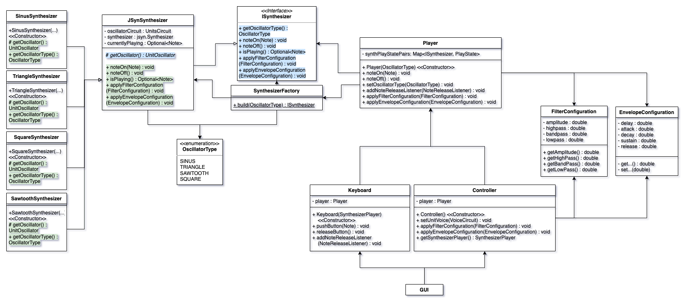
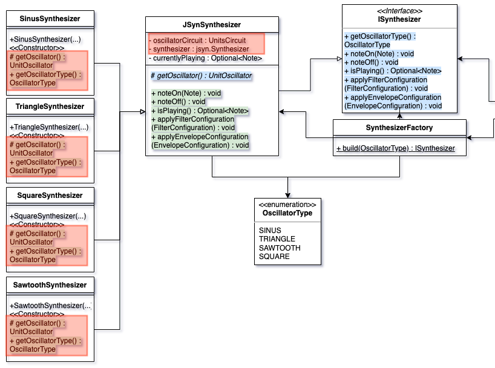

# JavaAudioSynthesizer
This repository contains a programming project, which has to be developed during a lecture at DHBW Karlsruhe. This documentation contains the results of analyzes and reasons for decisions made. 

## Entwurfsmuster

##### Einsatz begründen
UML Vorher / nacher

## Clean Architecture

##### Schichtarchitektur

## Domain Driven Design

##### Analyse der Ubiquitous Language

##### Analyse und Begründung der verwendeten Muster

## Programming Principles 

##### SOLID

##### GRASP

##### DRY

# Refactoring 1 - Technische Domäne von Fachlicher Domäne trennen
## Code Smell
Für die Synthetisierung von Klang wird aktuell eine Library namens "JSyn" verwendet. Der Synthesizer von jsyn benötigt zum Synthetisieren eines Tons einen Oszillator. Es gibt verschiedene Arten von verfügbaren Oszillatoren. Für die Konfiguration der Klangfarbe werden zusätzlich Filter und ein "Envelope" Tool, was das Ein- und Ausklingen des Tons bestimmt, benötigt. Anfangs wurde diese Library in verschiedenen Stellen der Applikation verwendet, wobei einzelne Klassen, wie z.B. Synthesizer Objekte von den Oszillator Objekten an verschiedenen Orten gespeichert und verwendet wurden. Zum Beispiel: 

- In SynthesizerPlayer: *UnitVoice*, *Synthesizer*
- In OscillatorVoiceUnit: *UnitOscillator*, *Circuit*, + mehrere Module zur Klangmodifikation
- In VoiceCircuit: *UnitVoice*

In der folgenden Abbildung wurden die verschiedenen Speicher- oder Verwendungsorte farblich markiert. 

## Begründung des Refactorings
Die Library zur Klangerzeugung lässt sich also nicht leicht austauschen. Um das zu ändern, soll nur noch ein Objekt, der vollständigen Erzeugung eines Tons dienen. Mehrere Objekte der JSyn Library sollen also in einer Klasse gekapselt werden, welche dann über ein Interface zugänglich ist. Im Folgenden ein vereinfachtes UML Diagramm nach angewendetem Refactoring.

Zur besseren Sicherbarkeit der relevanten Klassen: 

Die blau markierten Deklarationen, sind abstrakte Methoden, welche eine Implementieren benötigen. Die grün markierten Deklarationen sind die tatsächliche Implementierungen der abstrakten Methoden. 

Dabei wurde das Factory Pattern verwendet, welches anhand des Enums *OscillatorType* die passende Implementierung baut und zurückgibt. 

Die Klasse *JSynSynthesizer* enthält bis auf den Oszillator alle nötigen Objekte um mit der JSyn Library Klang zu erzeugen. Der Oszillator wird dann durch Vererbung von der Kind Klasse beigesteuert. Eine Kind Klasse implementiert also die Verwendung eines Oszillator-Typs. 